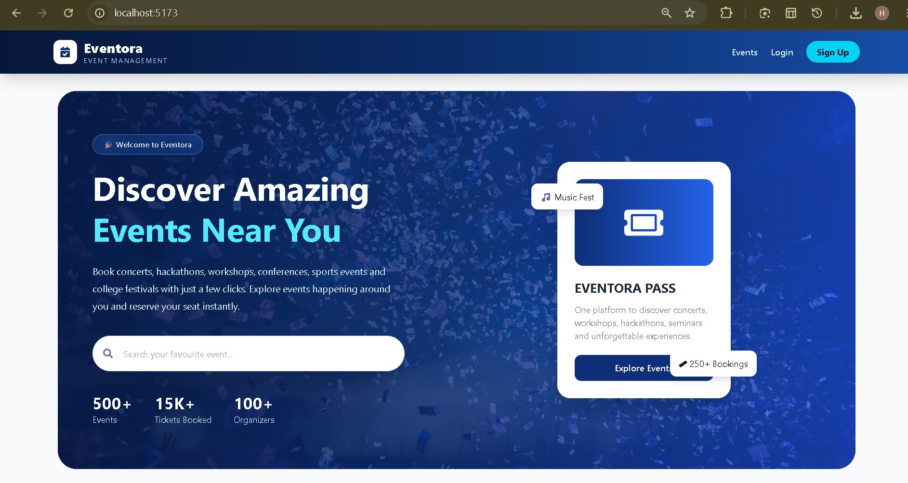
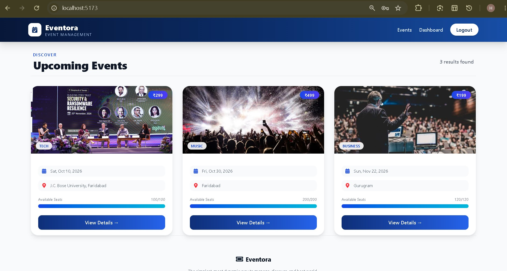
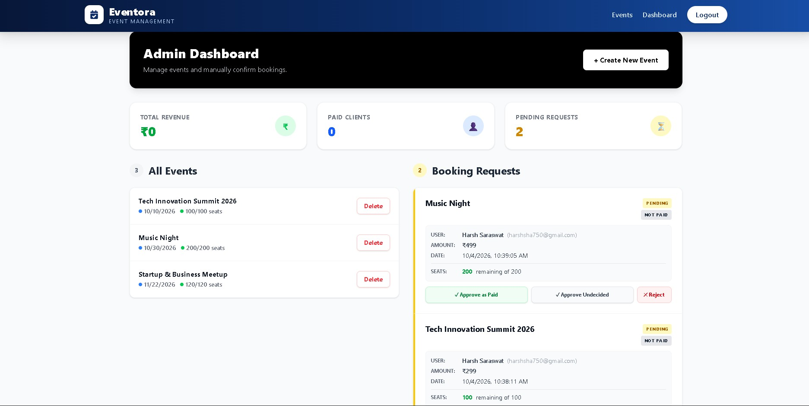

# Eventora – Event Management System

## Screenshots

<table>
  <tr>
    <td align="center">
      <b>Home Page</b><br>
      
    </td>
    <td align="center">
      <b>Events Page</b><br>
      
    </td>
    <td align="center">
      <b>Admin Dashboard</b><br>
      
    </td>
  </tr>
</table>

Eventora is a full-stack event management web application that allows users to discover events, register for events, and manage their bookings. It also provides an admin dashboard for creating and managing events.

## Features

### User Features

* User registration and login
* OTP-based account verification
* Browse and search events
* View event details
* Check available seats and ticket prices
* Book events using OTP verification
* View personal bookings
* Cancel bookings
* Email notifications

### Admin Features

* Admin authentication
* Create new events
* Update event details
* Delete events
* View and manage bookings
* Confirm paid bookings

## Tech Stack

**Frontend**

* React.js
* Tailwind CSS
* Axios
* Vite

**Backend**

* Node.js
* Express.js
* REST API

**Database**

* MongoDB
* Mongoose

**Authentication & Email**

* JWT Authentication
* Nodemailer
* OTP Verification

**API Testing**

* Postman

## Project Structure

```text
Eventora/
│
├── client/
│   ├── src/
│   ├── package.json
│   ├── package-lock.json
│   ├── vite.config.js
│   └── ...
│
├── server/
│   ├── controllers/
│   ├── middleware/
│   ├── models/
│   ├── routes/
│   ├── utils/
│   ├── index.js
│   ├── package.json
│   ├── package-lock.json
│   └── .env.example
│
├── postman/
│   └── Eventora_API_Collection.json
│
├── Screenshots-Eventora/
│   ├── eventorafront.jpg
│   ├── eventsshow.jpg
│   └── adminapproved.jpg
│
└── README.md
```

## Main API Modules

### Authentication

* Register user
* Verify account using OTP
* Login user

### Events

* Get all events
* Get event by ID
* Create event
* Update event
* Delete event
* Search and filter events

### Bookings

* Send booking OTP
* Verify OTP and create booking
* View user bookings
* Confirm booking
* Cancel or reject booking

## Installation

### 1. Clone the Repository

```bash
git clone YOUR_GITHUB_REPOSITORY_URL
cd Eventora
```

### 2. Install Frontend Dependencies

```bash
cd client
npm install
```

### 3. Install Backend Dependencies

Open another terminal:

```bash
cd server
npm install
```

### 4. Configure Environment Variables

Create a `.env` file inside the `server` folder.

Use `.env.example` as a reference:

```env
MONGODB_URI=
JWT_SECRET=
EMAIL_USER=
EMAIL_PASS=
```

Add your own values locally.

**Never upload the `.env` file to GitHub.**

### 5. Run the Backend

```bash
cd server
npm run dev
```

The backend runs on:

```text
http://localhost:5000
```

### 6. Run the Frontend

```bash
cd client
npm run dev
```

The frontend will run on the local Vite development server shown in your terminal.

## API Testing

The project includes a Postman collection containing the main Eventora API endpoints.

The collection covers:

* Authentication
* Events
* Bookings
* Admin operations

Import:

```text
postman/Eventora_API_Collection.json
```

into Postman to test the APIs.

## Security

Sensitive information is not included in this repository.

The following file should remain private:

```text
.env
```

Database credentials, JWT secrets, email passwords, API keys, and authentication tokens should never be committed to GitHub.

## Future Improvements

* Online payment gateway integration
* Event image upload
* Improved event filtering
* Event reminders
* Advanced admin analytics
* Deployment with production environment variables

## Purpose

Eventora was developed as a practical full-stack project to understand:

* Frontend and backend integration
* REST API development
* Authentication and authorization
* MongoDB database management
* OTP-based verification
* Email integration
* Event booking workflows
* Admin and user role management

## Author

**BHUMIKA SARASWAT**

Eventora is developed as an academic and learning project demonstrating full-stack web development.
